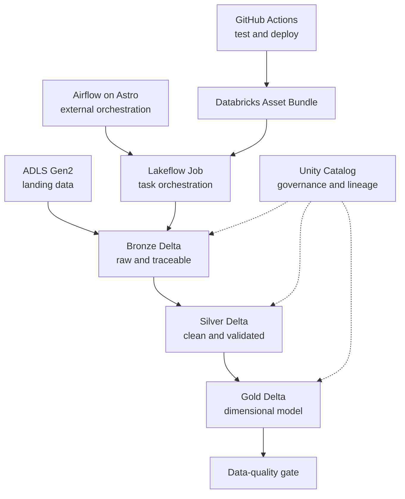

# OrderFlow

[](https://github.com/dominikchlodowicz/OrderFlow/actions/workflows/ci.yml)

[](LICENSE)

OrderFlow is a production-style Azure lakehouse project that turns batch commerce data into governed, analytics-ready dimensional models. It demonstrates the complete engineering lifecycle: PySpark transformations, Delta Lake storage, Unity Catalog governance, Databricks Asset Bundle deployment, Lakeflow orchestration, runtime data-quality gates, Airflow coordination, and GitHub Actions CI/CD.

The project deliberately uses cost-conscious development infrastructure. It demonstrates production engineering patterns without claiming production scale or operating a permanently hosted Airflow environment.

## Engineering highlights

- Eleven business domains processed through bronze, silver, and gold layers.
- PySpark transformations implemented as a tested Python package rather than notebook-only logic.
- Delta Lake tables registered and governed through Unity Catalog.
- Kimball-style dimensional model with conformed dimensions and analytical fact tables.
- Multi-task Lakeflow job deployed as code with Databricks Asset Bundles.
- Reusable data-quality framework with a final job-level quality gate.
- Idempotent batch processing designed for safe retries and manual reruns.
- Apache Airflow DAG that triggers and monitors the complete Lakeflow job.
- GitHub Actions validation for Python, data quality, Databricks bundles, and Airflow.
- Controlled development deployment with an optional manually triggered integration run.

## Architecture



The responsibilities remain intentionally separate:

| Component | Responsibility |
|---|---|
| GitHub Actions | Validates code and deploys the development bundle |
| Databricks Asset Bundles | Defines versioned jobs, tasks, compute, parameters, and artifacts |
| Airflow | Triggers and monitors the complete external workflow |
| Lakeflow Jobs | Executes the dependency graph inside Databricks |
| PySpark | Performs ingestion, transformation, modelling, and validation |
| ADLS Gen2 and Delta Lake | Persist lakehouse data and transactional tables |
| Unity Catalog | Governs tables, permissions, metadata, and lineage |

Airflow does not duplicate the Lakeflow task graph. It submits one job run and propagates its final status, while Lakeflow owns the detailed Databricks execution plan.

## Data domains

OrderFlow processes the following domains:

- calendar;
- customers;
- currencies and exchange rates;
- marketing campaigns;
- products;
- orders;
- order items;
- payments;
- refunds;
- shipments;
- web events.

## Medallion architecture

| Layer | Purpose | Typical operations |
|---|---|---|
| Bronze | Preserve raw source records with ingestion metadata | Schema application, source metadata, append/controlled reload |
| Silver | Produce clean domain-level datasets | Casting, normalization, validation, deduplication, invalid-record handling |
| Gold | Serve analytical use cases | Surrogate keys, conformed dimensions, facts, business measures, relationships |

The gold layer includes:

**Dimensions**

- `dim_calendar`
- `dim_customers`
- `dim_currency`
- `dim_campaigns`
- `dim_products`

**Facts**

- `fct_exchange_rates`
- `fct_orders`
- `fct_order_items`
- `fct_payments`
- `fct_refunds`
- `fct_shipments`
- `fct_web_events`

## Reliability and idempotency

Retries and manual reruns are expected operating conditions. The pipeline therefore avoids blind append behaviour for curated targets. Each table uses an explicit strategy appropriate to its grain, such as key-based merge, controlled replacement of a batch or partition, or append guarded by uniqueness validation.

Reliability controls include:

- deterministic table grains and business keys;
- explicit task dependencies;
- bounded Lakeflow retries and timeouts;
- one concurrent pipeline run in the development environment;
- queueing instead of overlapping executions;
- reusable schema and required-column validation;
- a final data-quality task that fails the complete workflow;
- Airflow propagation of the Databricks terminal state.

## Data quality

Data quality is implemented at two levels:

1. Unit tests exercise validation and transformation behaviour with small Spark DataFrames.
2. Runtime checks validate the actual Unity Catalog tables created by the pipeline.

The quality framework supports:

- required columns and schema contracts;
- non-null constraints;
- primary and business-key uniqueness;
- accepted categorical values;
- numeric ranges;
- chronological consistency;
- foreign-key resolution;
- non-empty batch validation;
- cross-table reconciliation where source semantics allow it.

All checks are evaluated before the quality task raises an exception, producing one actionable report instead of stopping at the first violation. A critical failure follows this path:

```text
PySpark quality failure
    → Lakeflow task failure
    → Lakeflow job failure
    → Airflow task failure
```

See [`docs/data_quality.md`](docs/data_quality.md) for the implemented contracts and extension guide.

## Testing

The test suite covers transformation logic, schemas, data contracts, failure cases, and orchestration definitions.

```bash
black --check src tests scripts
ruff check src tests scripts airflow/tests
pytest
python -m build
```

Airflow validation runs independently inside the Astro Runtime image:

```bash
cd airflow
ORDERFLOW_JOB_ID=1 astro dev parse
ORDERFLOW_JOB_ID=1 astro dev pytest
```

Tests do not require access to Azure, ADLS Gen2, Unity Catalog, or a running Databricks cluster.

## CI/CD

Pull requests run three independent validation areas:

| Check | Coverage |
|---|---|
| Python validation | Black, Ruff, focused quality tests, complete pytest suite, wheel build |
| Databricks bundle validation | Authenticated validation of the development bundle and variables |
| Airflow validation | Astro DAG parsing and DAG tests without triggering Databricks |

After a reviewed change is merged into `main`, the CD workflow validates and deploys the `dev` bundle. It does not automatically execute the Lakeflow pipeline. A controlled integration run can be started manually through `workflow_dispatch` with an optional batch identifier.

See [`docs/ci-cd.md`](docs/ci-cd.md) for required GitHub variables, secrets, workflow behaviour, and local equivalents.

## Repository structure

```text
OrderFlow/
├── .github/
│   └── workflows/        # CI and development deployment workflows
├── .vscode/              # Shared editor configuration
├── airflow/              # Astro project, OrderFlow DAG, and DAG tests
├── databricks/           # Databricks notebook entry points
├── dev/                  # Local development resources
├── docs/                 # Data-quality and CI/CD documentation
├── resources/            # Databricks Lakeflow job definitions
├── scripts/              # Supporting development and ingestion scripts
├── src/
│   └── orderflow/        # Reusable Python and PySpark package
├── tests/                # Unit, transformation, and data-quality tests
├── typings/              # Type stubs for Databricks-specific APIs
├── .env.example          # Environment-variable template without credentials
├── .gitignore            # Local and generated file exclusions
├── LICENSE               # Apache 2.0 license
├── README.md             # Project overview and usage instructions
├── databricks.yml        # Databricks Asset Bundle entry point
└── pyproject.toml        # Package, test, lint, and build configuration
```

## Getting started

### Prerequisites

- Python version supported by `pyproject.toml`
- Java runtime compatible with the local PySpark version
- Databricks CLI
- Access to an Azure Databricks workspace
- Docker Desktop and Astro CLI for local Airflow

### Install the Python project

```bash
python -m venv .venv
source .venv/bin/activate
python -m pip install --upgrade pip
python -m pip install -e .
```

### Configure the Databricks target

Use Databricks unified authentication. Do not commit credentials.

```bash
export DATABRICKS_HOST="https://<workspace>.azuredatabricks.net"
export DATABRICKS_BUNDLE_VAR_cluster_policy_id="<cluster-policy-id>"
```

Then validate and deploy:

```bash
databricks bundle validate -t dev
databricks bundle deploy -t dev
databricks bundle summary -t dev
```

Run the deployed workflow explicitly:

```bash
databricks bundle run -t dev orderflow_pipeline
```

### Run Airflow locally

Create `airflow/.env` locally:

```dotenv
ORDERFLOW_JOB_ID=<deployed-databricks-job-id>
AIRFLOW__CORE__TEST_CONNECTION=Enabled
```

Configure the Airflow connection `databricks_default` using the Azure Databricks workspace host and a development credential. The connection is stored in the local Airflow metadata database and must not be committed.

```bash
cd airflow
astro dev start
astro dev run dags list
```

Open the Airflow UI at `http://localhost:8080`, enable the OrderFlow DAG, and trigger a controlled run.

## Development compute and cost controls

The development bundle uses policy-controlled, single-node Databricks jobs compute. This is a deliberate portfolio cost decision rather than a recommended production sizing model.

Controls include:

- ephemeral jobs compute;
- single-node development execution;
- cluster policy enforcement;
- bounded retries and task timeouts;
- a maximum of one concurrent job run;
- no automatic Lakeflow execution on every pull request or merge.

## Security

- Credentials are supplied through local environment variables, Airflow connections, and GitHub secrets.
- `.env`, Databricks profiles, local databases, build artifacts, and bundle state are excluded from Git.
- The development GitHub workflow uses a scoped Azure Databricks token.
- Production deployment should replace user PATs with workload identity federation or a service principal using short-lived credentials.

## Implementation references

- [CI workflow](.github/workflows/ci.yml)
- [Development deployment workflow](.github/workflows/deploy-dev.yml)
- [Lakeflow job definition](resources/orderflow.job.yml)
- [Airflow DAG](airflow/dags/orderflow_pipeline.py)
- [Data-quality contracts](docs/data_quality.md)

## Design decisions and trade-offs

- **Lakeflow owns internal Databricks orchestration.** Reproducing every notebook as an Airflow task would create two competing dependency graphs.
- **Airflow remains an external coordinator.** It demonstrates scheduling, retries, monitoring, and integration with the Databricks Jobs API.
- **GitHub Actions deploys but does not orchestrate data.** CI/CD and runtime orchestration have separate responsibilities.
- **Native PySpark quality checks keep the project focused.** An additional data-quality framework would add operational weight without improving the learning objective.
- **Development compute prioritizes cost.** Production sizing would depend on measured data volume, latency targets, and workload concurrency.

## Current limitations and production evolution

This repository demonstrates production-style engineering patterns in a development portfolio environment. It does not claim production workload scale.

A production implementation would add:

- separate development, staging, and production targets;
- managed Airflow or another highly available external orchestrator;
- workload identity federation or service-principal authentication;
- alerting, SLAs, runbooks, and centralized observability;
- workload-based cluster sizing and autoscaling;
- formal release promotion and rollback procedures;
- downstream semantic models or BI serving contracts.

## License

Licensed under the [Apache License 2.0](LICENSE).

## Author

Developed by [Dominik Chłodowicz](https://github.com/dominikchlodowicz).
